# 🔗 DIAGRAMA DE RELACIONES: LOS 6 ARCHIVOS DEL MÓDULO 1

## 📐 ARQUITECTURA EN CAPAS

```
┌─────────────────────────────────────────────────────────────────┐
│                     WEB API LAYER (Presentación)                │
│                                                                 │
│  AlertaController.cs                                           │
│  ├─ [HttpPost("lorawan-webhook")]                             │
│  │   ├─ 1️⃣ Recibe POST TTS                                    │
│  │   ├─ 2️⃣ Parse end_device_ids → DevEUI, deviceId           │
│  │   ├─ 3️⃣ Decodifica frm_payload Base64                      │
│  │   ├─ 4️⃣ Extrae: lat, lon, battery                         │
│  │   ├─ 5️⃣ BuscarPorDeviceIdAsync() ──┐                       │
│  │   ├─ 6️⃣ Crea Alerta entity          ↓                       │
│  │   └─ 7️⃣ Envía a UseCase ───────────┐                       │
│  │                                      ↓                       │
├─────────────────────────────────────────────────────────────────┤
│            APPLICATION LAYER (Lógica de Negocio)               │
│                                                                 │
│  RegistrarAlertaUseCase.cs                                      │
│  ├─ EjecutarAsync(Alerta)                                      │
│  │  ├─ Step 1: BuscarAlertaRecienteAsync() ────┐               │
│  │  │          (últimos 10 min)                ↓               │
│  │  ├─ Step 2: SI alerta activa:               │               │
│  │  │          ├─ CantidadActivaciones++       │               │
│  │  │          ├─ CalcularNivelUrgencia()      │               │
│  │  │          └─ UpdateFieldsAsync()          │               │
│  │  │                                           ↓               │
│  │  └─ Step 3: SI NO activa:                                   │
│  │             ├─ ListarAlertasAsync()                         │
│  │             ├─ Busca anterior (cualquier estado)            │
│  │             ├─ SI resuelto O >5 horas:                      │
│  │             │   └─ NUEVA alerta (reset)                     │
│  │             └─ SI SINO:                                     │
│  │                 ├─ RECURRENCIA (heredar)                    │
│  │                 ├─ Marca anterior como vencida              │
│  │                 └─ Crea alerta CRÍTICA ────┐                │
│  │                                             ↓                │
├─────────────────────────────────────────────────────────────────┤
│               DOMAIN LAYER (Lógica de Dominio)                 │
│                                                                 │
│  Alerta.cs (Entity)                                            │
│  ├─ Properties:                                                │
│  │  ├─ Obligatorios: DevEUI, Lat, Lon, Bateria               │
│  │  ├─ Urgencia: CantidadActivaciones, NivelUrgencia         │
│  │  ├─ Recurrencia: EsRecurrente, UltimaActivacion           │
│  │  └─ Estado: Estado, FechaTomada, FechaLlegada             │
│  │                                                             │
│  ├─ Métodos:                                                  │
│  │  ├─ CalcularNivelUrgencia() → "baja"|"media"|"critica"   │
│  │  ├─ DebeArchivarse() → bool                               │
│  │  ├─ EstaDentroDelRango() → bool                           │
│  │  └─ IncrementarActivacion() → void                        │
│  │                                                             │
│  IAlertaRepository (Interface/Contrato)                        │
│  ├─ SaveAsync(Alerta)                                         │
│  ├─ UpdateFieldsAsync(id, updates)                            │
│  ├─ BuscarAlertaRecienteAsync(devEUI, desde) ───┐            │
│  └─ ListarAlertasAsync() ───────────────────────┤            │
│                                                 ↓             │
├─────────────────────────────────────────────────────────────────┤
│            INFRASTRUCTURE LAYER (Persistencia)                │
│                                                                 │
│  AlertaRepositoryFirestore.cs                                  │
│  ├─ implements IAlertaRepository                              │
│  └─ SaveAsync() ────────────┐                                 │
│     ├─ Normaliza DateTime ──→ UTC                             │
│     ├─ Mapea Alerta fields ─→ Firestore format               │
│     └─ AddAsync("alertas") ─→ Firestore collection           │
│                                                                 │
│  UserRepositoryFirestore.cs                                    │
│  ├─ implements IUserRepositoryFirestore                       │
│  └─ BuscarPorDeviceIdAsync(deviceId)                          │
│     ├─ Query: WHERE device_id = deviceId                      │
│     └─ Returns: UsuarioDto (correlación user)                 │
│                                                                 │
│  ┌──────────────────────────────────────────────────────┐    │
│  │    FIRESTORE DATABASE (Google Cloud)                │    │
│  │                                                      │    │
│  │  Collection: "alertas"                              │    │
│  │  ├─ devEUI, lat, lon, bateria                       │    │
│  │  ├─ cantidadActivaciones, nivelUrgencia             │    │
│  │  ├─ esRecurrente, estado                            │    │
│  │  └─ fechaCreacion, timestamp, ...                   │    │
│  │                                                      │    │
│  │  Collection: "users"                                │    │
│  │  ├─ device_id (índice)                              │    │
│  │  ├─ nombre, apellido, dni                           │    │
│  │  └─ email, role, ...                                │    │
│  └──────────────────────────────────────────────────────┘    │
│                                                                 │
└─────────────────────────────────────────────────────────────────┘
```

---

## 🔀 FLUJO DE DATOS: WEBHOOK → BD

```
┌─────────────────────┐
│ TTS Webhook JSON    │
│ {                   │
│   end_device_ids: { │
│     dev_eui: "...", │
│     device_id: "..."│
│   },                │
│   uplink_message: { │
│     frm_payload:    │ ← Base64 encoded
│       "AQIDBA..."   │
│     locations: {    │ ← Fallback GPS
│       user: {...}   │
│     }               │
│   }                 │
│ }                   │
└─────────────────────┘
        ↓
┌─────────────────────────────────────┐
│ AlertaController.RegistrarLorawanWebhook()
├─────────────────────────────────────┤
│ 1️⃣ PARSE: end_device_ids            │
│    → DevEUI = "70B3D57ED003F00F"    │
│    → deviceId = "paxel-vic-01"      │
│                                      │
│ 2️⃣ DECODIFICAR: frm_payload         │
│    Base64 "AQIDBA..." →             │
│    Bytes [01,02,03,04] →            │
│    UTF-8 "{"GPS":"...","Batt":...}" │
│    JSON Parse → GPS: "12.3,45.6"    │
│                   Battery: 95.2     │
│                                      │
│ 3️⃣ EXTRAER:                         │
│    → lat = 12.3                     │
│    → lon = 45.6                     │
│    → bateria = 95.2                 │
│                                      │
│ 4️⃣ BUSCAR VÍCTIMA:                  │
│    UserRepository.BuscarPorDeviceIdAsync(
│        "paxel-vic-01"
│    )                                │
│    → Firestore WHERE device_id =... │
│    → Retorna: UsuarioDto            │
│       {nombre: "Maria", ...}        │
└─────────────────────────────────────┘
        ↓
┌─────────────────────────────────────┐
│ CREAR ENTITY ALERTA                 │
├─────────────────────────────────────┤
│ new Alerta(                         │
│   devEUI: "70B3D57...",             │
│   lat: 12.3,                        │
│   lon: 45.6,                        │
│   bateria: 95.2,                    │
│   timestamp: 2025-03-22 15:30:45,   │
│   deviceId: "paxel-vic-01",         │
│   nombreVictima: "Maria"            │
│ )                                   │
│                                      │
│ Inicializa:                         │
│ - CantidadActivaciones = 1          │
│ - NivelUrgencia = "baja"            │
│ - EsRecurrente = false              │
│ - Estado = "disponible"             │
└─────────────────────────────────────┘
        ↓
┌──────────────────────────────────────────┐
│ RegistrarAlertaUseCase.EjecutarAsync()   │
├──────────────────────────────────────────┤
│ IF (existe alerta ACTIVA <10min):        │
│    ├─ CantidadActivaciones++             │
│    ├─ NivelUrgencia = Calcular()         │
│    │  IF activations >= 4: "critica"     │
│    │  IF activations >= 2: "media"       │
│    │  ELSE: "baja"                       │
│    └─ UpdateFieldsAsync() en Firestore   │
│                                          │
│ ELSE (NO hay alerta activa):             │
│    ├─ Buscar anterior (cualquier estado) │
│    ├─ IF anterior RESUELTA O >5h:        │
│    │  └─ NUEVA ALERTA                    │
│    │     (reset contador)                │
│    └─ ELSE:                              │
│       ├─ RECURRENCIA                     │
│       ├─ CantidadActivaciones += 1       │
│       ├─ NivelUrgencia = "critica" 🔴    │
│       ├─ EsRecurrente = true             │
│       └─ Marca anterior como "vencida"   │
│                                          │
│ SIEMPRE: SaveAsync() o UpdateFieldsAsync()└─┐
└──────────────────────────────────────────────┤
        ↓                                      ↓
┌────────────────────────────────────────────────────┐
│ AlertaRepositoryFirestore (Persistencia)           │
├────────────────────────────────────────────────────┤
│ SaveAsync(Alerta):                                 │
│   ├─ Normaliza DateTime → UTC                     │
│   ├─ Mapea Alerta → documento Firestore:         │
│   │  {                                            │
│   │    devEUI: "70B3D57...",                      │
│   │    lat: 12.3,                                │
│   │    lon: 45.6,                                │
│   │    bateria: 95.2,                            │
│   │    cantidadActivaciones: 1,                   │
│   │    nivelUrgencia: "baja",                     │
│   │    esRecurrente: false,                       │
│   │    estado: "disponible",                      │
│   │    nombre_victima: "Maria",                   │
│   │    fechaCreacion: Timestamp(UTC),             │
│   │    timestamp: Timestamp(UTC)                  │
│   │  }                                            │
│   └─ AddAsync("alertas") → Firestore             │
│                                                    │
│ UpdateFieldsAsync(alertaId, updates):             │
│   ├─ Normaliza campos DateTime                    │
│   ├─ UpdateAsync(...) → Firestore                │
│   └─ Actualización atómica (field-level)          │
└────────────────────────────────────────────────────┘
        ↓
┌────────────────────────────────────────────────────┐
│ Firestore Collection "alertas"                     │
├────────────────────────────────────────────────────┤
│ Document ID (auto-generated):                      │
│ {                                                  │
│   devEUI: "70B3D57ED003F00F",                     │
│   lat: 12.3,                                      │
│   lon: 45.6,                                      │
│   bateria: 95.2,                                  │
│   cantidadActivaciones: 1,                        │
│   nivelUrgencia: "baja",                          │
│   esRecurrente: false,                            │
│   estado: "disponible",                           │
│   nombre_victima: "Maria",                        │
│   fechaCreacion: 2025-03-22T15:30:45Z,            │
│   timestamp: 2025-03-22T15:30:45Z,                │
│   ultimaActivacion: 2025-03-22T15:30:45Z          │
│ }                                                  │
└────────────────────────────────────────────────────┘
```

---

## 🎯 RELACIONES CLAVE ENTRE ARCHIVOS

### 1️⃣ AlertaController → RegistrarAlertaUseCase

```
AlertaController                    RegistrarAlertaUseCase
      │                                    │
      ├─ Inyecta en constructor           │
      │  private _registrarAlertaUseCase;  │
      │                                    │
      ├─ Llama:                           │
      │  await _registrarAlertaUseCase     │
      │    .EjecutarAsync(alerta)  ────→  EjecutarAsync(Alerta nuevaAlerta)
      │                                    │
      │                                    ├─ Algoritmo de urgencia
      │                                    ├─ Detección recurrencia
      │                                    └─ Cálculo NivelUrgencia
      │
      └─ NO CONOCE detalles del algoritmo
         Solo conoce que existe una operación
```

**Buena Práctica**: 
- Controller NO contiene lógica
- UseCase encapsula regla de negocio
- Fácil de testear: tests unitarios de RegistrarAlertaUseCase

---

### 2️⃣ RegistrarAlertaUseCase → IAlertaRepository

```
RegistrarAlertaUseCase              IAlertaRepository (Interfaz)
      │                                    │
      ├─ Inyecta:                        │
      │  private readonly                │
      │  IAlertaRepository _repository   │
      │                                   │
      ├─ Llama:                          │
      │  _repository                     │
      │    .BuscarAlertaRecienteAsync() ─→ Task<Alerta?>
      │  _repository                     │
      │    .UpdateFieldsAsync()         ─→ Task
      │  _repository                     │
      │    .SaveAsync()                 ─→ Task
      │  _repository                     │
      │    .ListarAlertasAsync()        ─→ Task<List<Alerta>>
      │
      └─ NO CONOCE que existe Firestore
         Podría ser MongoDB, SQL Server, etc.
```

**Buena Práctica**:
- Depend on Abstraction (DIP)
- Loose coupling: pueden cambiar implementaciones
- Mock en tests: pasar implementación fake

---

### 3️⃣ AlertaController → UserRepositoryFirestore (para correlación)

```
AlertaController                    UserRepositoryFirestore
      │                                    │
      ├─ Sabe:                            │
      │  Tengo deviceId="paxel-vic-01"   │
      │  Necesito encontrar usuario       │
      │                                    │
      ├─ Llama:                          │
      │  await _userRepository            │
      │    .BuscarPorDeviceIdAsync()  ────→ Query Firestore:
      │          (deviceId)                   WHERE device_id = "paxel-vic-01"
      │                                        Return: UsuarioDto {
      │  ← Retorna UsuarioDto                   nombre: "Maria",
      │    {                                    apellido: "Garcia",
      │      nombre: "Maria",                   dni: "12345678",
      │      apellido: "Garcia",                ...
      │      dni: "12345678"              }
      │    }
      │
      └─ Extrae nombre para Alerta
         nombreVictima = "Maria Garcia"
```

**Buena Práctica**:
- Correlación device ↔ user encapsulada
- Repository maneja complejidad Firestore
- Controller solo usa resultado

---

### 4️⃣ Alerta ← AlertaRepositoryFirestore (Mapping bidireccional)

```
CREAR (Desde webhook):

AlertaController
  ├─ new Alerta(devEUI, lat, lon, bateria, timestamp, deviceId, nombreVictima)
  │  └─ Inicializa con defaults:
  │     CantidadActivaciones = 1
  │     NivelUrgencia = "baja"
  │     Estado = "disponible"
  │
  └─ Pasa a RegistrarAlertaUseCase ...
     └─ Pasa a AlertaRepositoryFirestore.SaveAsync()
        └─ Mapea a documento Firestore:
           {
             devEUI: alerta.DevEUI,
             cantidadActivaciones: alerta.CantidadActivaciones,
             nivelUrgencia: alerta.NivelUrgencia,
             ...
           }


LEER (Desde BD):

AlertaRepositoryFirestore.BuscarAlertaRecienteAsync()
  ├─ Query Firestore: WHERE devEUI=X AND timestamp>=Y
  ├─ Obtiene DocumentSnapshot
  ├─ Mapea a objeto Alerta (constructor sobrecargado):
  │  new Alerta(
  │    devEUI: data["devEUI"],
  │    lat: data["lat"],
  │    ...,
  │    cantidadActivaciones: data["cantidadActivaciones"],
  │    nivelUrgencia: data["nivelUrgencia"],
  │    ...
  │  )
  └─ Retorna Alerta (completa, lista para usar)
      └─ RegistrarAlertaUseCase lo recibe y accede:
         alerta.CantidadActivaciones
         alerta.NivelUrgencia
         alerta.EstaDentroDelRango()
```

**Buena Práctica**:
- Múltiples constructores: para crear vs leer
- Data Mapper centralizado: solo AlertaRepositoryFirestore
- Entity desconoce Firestore

---

## 📊 MATRIZ DE DEPENDENCIAS

```
                         Depende De:
                    ↓
        |  Alert  | Regis | Alert | Alert | User  | IAlert
Archivo | Control | taUse | Repo  | Entity| Repo  | Repo
        |   .cs   | Case  | Fire  | .cs   | Fire  | .cs
--------|---------|-------|-------|-------|-------|-------
Alert   |    -    |  ✅   |  -    |  -    |  -    |  -
Control |         |       |       |       |       |
--------|---------|-------|-------|-------|-------|-------
Regis   |    -    |  -    |  ✅   |  ✅   |  -    |  ✅
taUse   |         |       |       |       |       |
--------|---------|-------|-------|-------|-------|-------
Alert   |    -    |  -    |  -    |  ✅   |  -    |  -
Repo    |         |       |       |       |       |
Fire    |         |       |       |       |       |
--------|---------|-------|-------|-------|-------|-------
Alert   |    -    |  -    |  -    |  -    |  ✅   |  -
Entity  |         |       |       |       |       |
--------|---------|-------|-------|-------|-------|-------
User    |    -    |  -    |  -    |  -    |  -    |  -
Repo    |         |       |       |       |       |
Fire    |         |       |       |       |       |
--------|---------|-------|-------|-------|-------|-------
IAlert  |    -    |  -    |  -    |  -    |  -    |  -
Repo    |         |       |       |       |       |

✅ = Depende (inyección o herencia)
-  = No depende
```

---

## 🔀 TABLA: RESPONSABILIDAD DE CADA ARCHIVO

| Archivo | Responsabilidad | NO Responsable De | Patrón |
|---------|---|---|---|
| **AlertaController.cs** | Recibir HTTP, parsear JSON, orquestar flujo | Lógica algoritmo, acceso BD, cálculos complejos | MVC Controller |
| **RegistrarAlertaUseCase.cs** | Calcular urgencia, detectar recurrencia, decidir alerta nueva vs actualcar | HTTP, BD, correlación de datos | Use Case / Command |
| **Alerta.cs** | Encapsular estado de alerta, reglas de dominio | HTTP, persistencia, consultas | Domain Entity / Rich Model |
| **AlertaRepositoryFirestore.cs** | Persistencia en Firestore, mapping Alerta ↔ Firestore | Lógica negocio, algoritmos | Repository, Data Mapper |
| **UserRepositoryFirestore.cs** | Persistencia usuarios, correlación device ↔ user | Lógica alerta, urgencia | Repository |
| **IAlertaRepository.cs** | Definir contrato, interfaz clara | Implementación, detalles | Interface / Contract |

---

## ✨ PUNTOS CLAVE DE LA ARQUITECTURA

### 🎯 Principio DIP (Dependency Inversion)

```
❌ ANTES (Acoplamiento fuerte):
    AlertaController
      └─ new RegistrarAlertaUseCase(
           new AlertaRepositoryFirestore(firestore)
         )
    ↳ Si cambias BD, cambias todo


✅ DESPUÉS (Acoplamiento débil):
    AlertaController (inyectado)
      └─ _registrarAlertaUseCase: RegistrarAlertaUseCase (inyectado)
           └─ _repository: IAlertaRepository (inyectado)
              └─ (Implementación puede ser cualquiera)
    ↳ Si cambias BD, solo cambias implementación
```

### 🎯 Separación de Responsabilidades

```
AlertaController:    "¿Qué llega del webhook?"
RegistrarAlertaUseCase: "¿Qué hago con los datos?"
Alerta:              "¿Cuál es mi estado y reglas?"
AlertaRepositoryFirestore: "¿Dónde y cómo guardo?"
UserRepositoryFirestore:  "¿Quién es esta víctima?"
```

### 🎯 Testabilidad

```
Para testear RegistrarAlertaUseCase:
  ├─ Paso mock de IAlertaRepository
  ├─ Mock devuelve alertas controladas
  └─ Test verifica: ¿Calcula urgencia correctamente?

Para testear AlertaController:
  ├─ Paso mock de RegistrarAlertaUseCase
  ├─ Test envía JSON webhook
  └─ Verifica: ¿Parse correcto? ¿Correlación correcta?
```

---

## 💾 PERSISTENCIA EN FIRESTORE

```
COLLECTIONS CREADAS:

alertas/
  ├─ Document: AUTO_GENERATED_ID
  │  ├─ devEUI: "70B3D57ED003F00F"
  │  ├─ lat: 12.3
  │  ├─ lon: 45.6
  │  ├─ bateria: 95.2
  │  ├─ cantidadActivaciones: 1
  │  ├─ nivelUrgencia: "baja"
  │  ├─ esRecurrente: false
  │  ├─ estado: "disponible"
  │  ├─ nombre_victima: "Maria Garcia"
  │  ├─ timestamp: Timestamp(2025-03-22T15:30:45Z)
  │  └─ fechaCreacion: Timestamp(2025-03-22T15:30:45Z)
  │
  ├─ Document: AUTO_GENERATED_ID (segunda alerta)
  │  └─ ...
  │
  └─ Document: AUTO_GENERATED_ID (... más alertas)
     └─ ...

users/
  ├─ Document: deviceId_or_uid
  │  ├─ device_id: "paxel-vic-01"
  │  ├─ nombre: "Maria"
  │  ├─ apellido: "Garcia"
  │  ├─ dni: "12345678"
  │  ├─ email: "maria@example.com"
  │  ├─ role: "victima"
  │  └─ ...
  │
  └─ Document: uid_otro_usuario
     └─ ...
```

---

## 🚀 FLUJO DE RECURRENCIA (Ejemplo)

```
ESCENARIO: Dispositivo se activa 3 veces en 2 horas

ALERTA 1 (T=0min):
  POST /api/alerta/lorawan-webhook {devEUI: "70B3...", lat: 12.3, ...}
  → RegistrarAlertaUseCase:
    ├─ NO hay alerta anterior
    └─ Crea: CantidadActivaciones=1, NivelUrgencia="baja", EsRecurrente=false
  → FIRESTORE:
     Documento: {cantidadActivaciones: 1, nivelUrgencia: "baja", ...}

ALERTA 2 (T=5min):
  POST /api/alerta/lorawan-webhook {devEUI: "70B3...", lat: 12.35, ...}
  → RegistrarAlertaUseCase:
    ├─ ENCUENTRA alerta activa (<10min)
    ├─ Incrementa: CantidadActivaciones = 2
    ├─ Recalcula: NivelUrgencia = "media" (porque 2 activaciones)
    ├─ Marca: UltimaActivacion = T=5min
    └─ UpdateFieldsAsync(): actualiza Documento anterior en Firestore
  → FIRESTORE:
     Documento ACTUALIZADO: {cantidadActivaciones: 2, nivelUrgencia: "media", ...}

ALERTA 3 (T=120min, >10min después de la última):
  POST /api/alerta/lorawan-webhook {devEUI: "70B3...", lat: 12.4, ...}
  → RegistrarAlertaUseCase:
    ├─ NO hay alerta activa (<10min)
    ├─ ENCUENTRA alerta anterior (estado: "disponible", cantidadActivaciones: 2)
    ├─ Calcula: 120 minutos (2 horas) desde UltimaActivacion
    ├─ Decisión: 2 horas < 5 horas → ES RECURRENCIA
    ├─ Acción:
    │  ├─ CantidadActivaciones = 3
    │  ├─ NivelUrgencia = "critica" 🔴
    │  ├─ EsRecurrente = true
    │  └─ Marca anterior como "vencida"
    └─ SaveAsync(): CREA nuevo documento en Firestore
  → FIRESTORE:
     Documento ANTERIOR marcado: {estado: "vencida"}
     Documento NUEVO: {
       cantidadActivaciones: 3,
       nivelUrgencia: "critica",
       esRecurrente: true
     }
```

---

## 📈 FLUJO CON DIAGRAM.IO

```mermaid
graph TD
    A["TTS Webhook<br/>(JSON)"] -->|POST| B["AlertaController<br/>RegistrarLorawanWebhook"]
    B -->|Parse| C["devEUI, deviceId<br/>Decodificar Base64"]
    C -->|Extrae| D["lat, lon, bateria"]
    B -->|BuscarPorDeviceId| E["UserRepositoryFirestore"]
    E -->|Query users| F["Firestore: users"]
    F -->|Correlación| B
    B -->|Crea| G["new Alerta&#40;&#41;"]
    G -->|EjecutarAsync| H["RegistrarAlertaUseCase"]
    H -->|BuscarAlertaRecienteAsync| I["IAlertaRepository"]
    I -->|Query alertas| J["AlertaRepositoryFirestore"]
    J -->|Query| K["Firestore: alertas"]
    K -->|Retorna| H
    H -->|CalcularNivelUrgencia| L["Alerta Entity"]
    H -->|SaveAsync o UpdateFieldsAsync| J
    J -->|Guarda/Actualiza| K
    K -->|Persiste| M["Firestore<br/>collection:alertas"]
```



